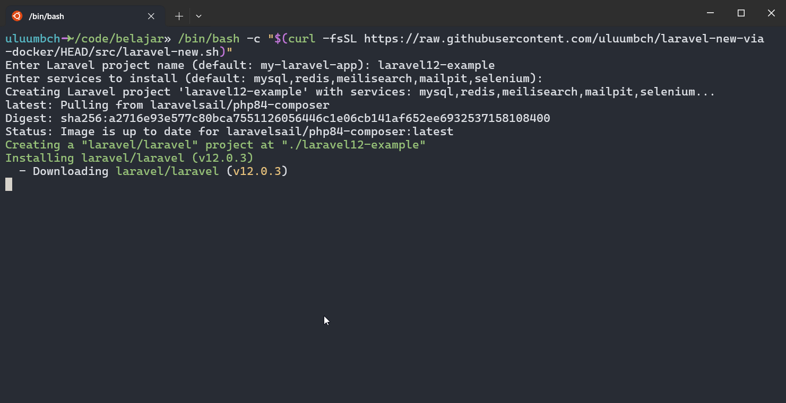

# laravel-new-via-docker
A simple script for running laravel installer via docker without need to install php in local computer


## Usage
1. run
   ```
   /bin/bash -c "$(curl -fsSL https://raw.githubusercontent.com/uluumbch/laravel-new-via-docker/HEAD/src/laravel-new.sh)"
   ```
2. Answer the question
3. 🚀Start develop your laravel project!


